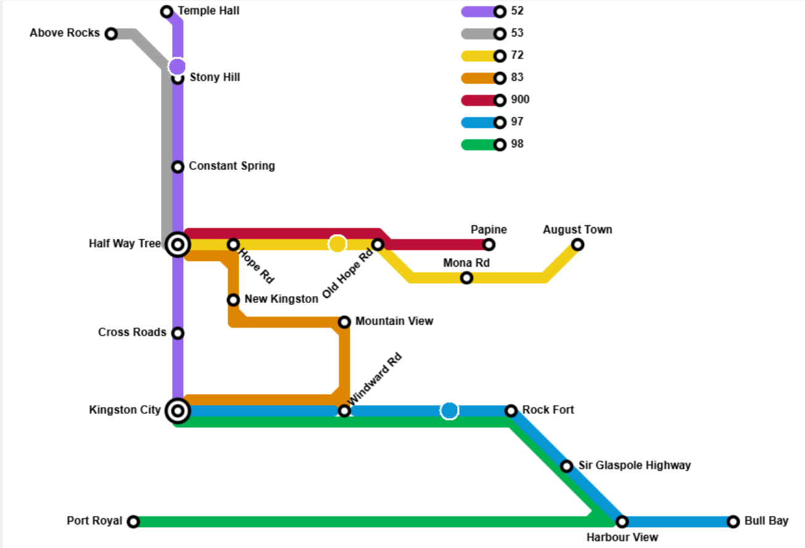

# JUTC Kingston Bus Tracker

A Python-based desktop application that simulates and tracks part of Jamaica Urban Transit Company (JUTC) bus routes using a schematic "metro-style" map interface.

## Overview

This project visualizes a small section of public transit routes in Kingston, Jamaica, offering a simplified, schematic view similar to the Tokyo Metro or London Underground maps. It uses Python's `tkinter` library to animate buses moving between stops.

The program currently simulates three specific routes:

* **Route 52:** Kingston City ↔ Temple Hall
* **Route 72:** Half Way Tree ↔ August Town
* **Route 97:** Kingston City ↔ Bull Bay

## Features

* **Schematic Visualization:** Uses a custom schematic map made with [metromapmaker.com](https://metromapmaker.com/map/_O6RQoy4) for a clean, easy-to-read interface.
* **Smooth Animation:** Implements linear interpolation with distance calculations to ensure buses move at a consistent speed across different route segment lengths.
* **Multiple Routes:** Supports simultaneous tracking of multiple buses on distinct paths with different speeds and colors.
* **Modular Codebase:** Logic, configuration, and execution are split into separate files for easy maintenance.
* **Pure Python:** Built using the standard library (`tkinter`, `math`), requiring no complex external dependencies.

## Requirements

* Python 3.x
* Tkinter (Usually included with standard Python installations)

## Screenshot

